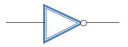

### INVERTER

Inverter is a logic gate, with one input and one output. Its symbol is shown below :-

The output of inverter is complement of the input i.e. if the input is 0, the output will be 1 and vice-versa. The truth table for inverter is shown below :-

| Inout  | Output |
| -------| -------|
|   0    |    1   |
|   1    |    0   |

The transistor level schematic of inverter can be designed in many logics, following two logics are commonly used for designing.

1. Complementary CMOS logic
2. Pseudo NMOS logic

### INTRODUCTION TO SPICE

SPICE (Simulation Program with Integrated Circuit Emphasis) is a powerful program that is used in integrated circuit and board-level design to check the integrity of circuit designs and to predict circuit behavior. SPICE was originally developed at the Electronics Research Laboratory of the University of California, Berkeley (1975). Simulating the circuit with SPICE is the industry-standard way to verify circuit operation at the transistor level before committing to manufacturing an integrated circuit. In spice program, circuit elements (transistors, resistors, capacitors, etc) and their connections being translated into a text net list.

Several types of circuit analyses can be done using SPICE program. Here are the most important ones-

 - DC analysis: calculates the DC transfer curve.
 - Transient analysis: calculates the voltage and current as a function of time when a large signal is applied.
 - AC Analysis: calculates the output as a function of frequency. A bode plot is generated.
 - Noise analysis.
 - Sensitivity analysis.
 - Distortion analysis.
 - Fourier analysis: calculates and plots the frequency spectrum.
 - Monte Carlo Analysis

All analyses can be done at different temperatures. The default temperature is 300K.

