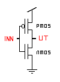

### Schematic Diagram

Below is the schematic diagram for the CMOS inverter circuit. The diagram shows the connections for the bulk terminals of both PMOS and NMOS transistors, as well as the sizes (W/L ratios) of the transistors:



- **PMOS:** Connect bulk to VDD
- **NMOS:** Connect bulk to GND

> **Note:** Always ensure the bulk terminals are properly connected: PMOS bulk to VDD, NMOS bulk to GND.

### Steps to Perform the Simulation

1. **Arrange the Code Blocks:**

- Start with the code block that defines the gate name, includes the MOSFET model file (`PTM_45nm.txt`), and declares parameters.
- Next, define the voltage source, specifying `vdd` as the positive terminal and `gnd` (or `0`) as the negative terminal.
- Define the inverter subcircuit, giving names to the input and output arguments.
- Inside the subcircuit block, instantiate the PMOS and NMOS transistors using the following format:
  ```
  INSTANCE_NAME DRAIN GATE SOURCE BODY NAME_OF_MOSFET_AS_MENTIONED_IN_MODEL_FILE_INCLUDED w=WIDTH l=LENGTH
  ```
- Assign instance names to both NMOS and PMOS. Connect the drain terminals to the output node, gates to the input, PMOS source and body to VDD, NMOS source and body to GND.
- End the subcircuit block with `.ends` followed by the subcircuit name.
- Instantiate the inverter subcircuit, providing `a` as input and `out` as output.

2. **Input Waveforms and Control Statements:**

- Define the input waveform for `a`.
- Add control statements to run the simulation and plot the required graphs.

3. **Naming Conventions:**

- Use only alphabets, `%`, `$`, or `_` as the starting character for subcircuit, node, variable, and instance names.
- Names can contain alphanumeric characters, `%`, `$`, and `_`.
- SPICE code is case-insensitive; avoid duplicate names regardless of case.

### Observations

- After completing the code, click "validate." If everything is correct, you should see a "Success" message, a report, and input/output graphs under the observations section.
- Observe the input and corresponding output waveforms.

---

**Summary:**  
This procedure ensures that the simulation setup is clear, the schematic is accurate (including bulk connections and transistor sizes), and the steps are easy to follow for successful SPICE simulation.
