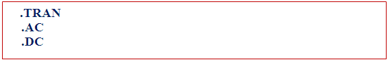
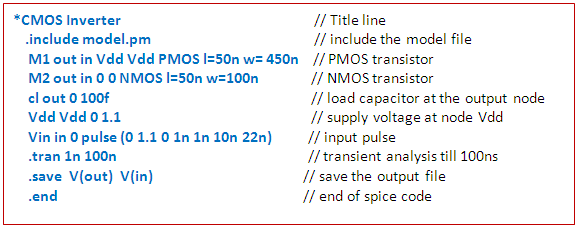
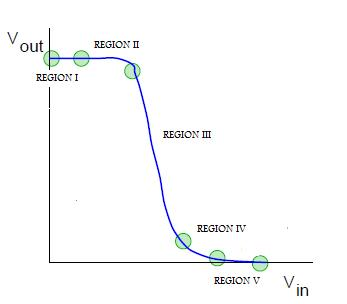

### SPICE Code

A spice input file, also called source file, consistsof three parts:

  - **Data statements:** These statements are description of the components and their I nterconnections.

  - **Control statements:** These statements are responsible to tell SPICE simulator what type of analysis to perform on the circuit.

  - **Output statements:** These statements specify what outputs are to be printed or plotted.

   Although these statements may appear in any order, it is recommended that they be given in the above sequence. Two other statements are required: the title statement and the end statement. The title statement is the first line and can contain any information, while the end statement is always .END. The title statement must be a line or word. In addition, you can insert comment statements, which must begin with an asterisk (*) and are ignored by SPICE Simulator.

  **1. Data Statements**

  (A).Independent DC Sources

   N1 is the positive terminal node. N2 is the negative terminal node. Type can be DC, AC or TRAN, depending on the type of analysis. Value gives the value of the source. The name of a voltage and current source must start with V and I, respectively.

   The positive current direction through the current or voltage source is from the positive (N1) node to the negative (N2) node:

(B) Elements: for example MOSFETS

   The MOS transistor name (Mname) has to start with a M; ND, NG, NS and NB are the node numbers of the Drain, Gate, Source and Bulk terminals, respectively. ModName is the name of the transistor model (NMOS or PMOS). L and W are the length and width of the gate (in m).

  2. Commands or Control Statements:

 .TRAN Statement

 
  
   This statement specifies the time interval over which the transient analysis takes place, and the time increments. The format is as follows: TSTEP is the printing increment. TSTOP is the final time TSTART is the starting time (if omitted, TSTART is assumed to be zero) TMAX is the maximum step size. UIC stands for Use Initial Conditions. If UIC is specified then simulator will use the initial conditions specified in the element statements.

 3.Output Statements

 These statements will instruct Simulator what output to generate. If you do not specify an output statement, Simulator will always calculate the DC operating points. The two types of outputs are the prints and plots. A print is a table of data points and a plot is a graphical representation. The format is as follows:

 In above format TYPE specifies the type of analysis to be printed or plotted and can be:

 The output variables are Y1, Y2 and can be voltage or currents in voltage sources. Node voltages and device currents can be specified as magnitude (M), phase (P), real (R) or imaginary (I) parts by adding the suffix to V or I as follows:

 M: Magnitude.

 DB: Magnitude in dB (decibels).

 P: Phase.

 R: Real part.

 I: Imaginary part.

Complete example (Inverter-Netlist):

 In introduction of this experiment we have seen what is spice actually. In first experiment we have designed inverter, so as we have read in introduction that whenever you place anyting like transistor or capacitor etc., there is a code which is written at back end corresponding to the element placed on screen. So in this experiment we are going to learn what is taht code which is written in the back end, that is, we learn how to write that code directly, that is, we will learn basic inverter designing using spice coding.

 The following is the code for inverter in spice along with some of the explaination.

Now we will be learning actually what parameters are specified by each of the element in every line in detail

 **FIRST LINE**

  First line of spice code is always a comment. So this line is always ignored by spice. Spice does not do any kind of processing on this line.

 **INCLUDE LINE**

 .include line includes the model file but you should confirm that your model file should be in your current directory in which you are working.

1. **.lib 'models25.txt'**
   - This line includes a library file named 'models25.txt.' The library file typically contains information about models for various components used in the circuit.

2. **TT mn1 VSS IN OUT VSS nmos |=0.24u w=0.72u**
   - Defines an nmos transistor named 'mn1' with specific characteristics:
     - `TT`: Type or Model Name (nmos transistor).
     - `mn1`: Instance name.
     - `VSS IN OUT VSS`: Connections for source, gate, drain, and bulk (substrate).
     - `nmos`: Specifies the transistor type.
     - `|=0.24u`: Sets the zero-bias threshold voltage to 0.24 volts.
     - `w=0.72u`: Specifies the width of the transistor as 0.72 microns.

3. **mp1 VDD IN OUT VDD pmos |=0.24u w=0.72u**
   - Similar to the previous line but for a pmos transistor:
     - `mp1`: Instance name.
     - `VDD IN OUT VDD`: Connections for source, gate, drain, and bulk.
     - `pmos`: Specifies the transistor type.
     - `|=0.24u`: Sets the zero-bias threshold voltage to 0.24 volts.
     - `w=0.72u`: Specifies the width of the transistor as 0.72 microns.

4. **cLoad OUT VSS 50fF**
   - Defines a capacitor named 'cLoad':
     - `OUT VSS`: Connections for one terminal connected to OUT and the other to VSS.
     - `50fF`: Specifies the capacitance of the capacitor as 50 femtofarads.

5. **vVDD VDD 0 2.5**
   - Defines a voltage source named 'vVDD':
     - `VDD 0`: Connections for positive terminal to VDD and negative terminal to the reference node (0 volts).
     - `2.5`: Specifies the voltage value as 2.5 volts.

6. **vVSS VSS 0 0**
   - Defines a voltage source named 'vVSS':
     - `VSS 0`: Connections for positive terminal to VSS and negative terminal to the reference node (0 volts).
     - `0`: Specifies the voltage value as 0 volts.

7. **VIN IN 0 pulse(0 2.5 100ps 100ps 100ps 2ns 4ns)**
   - Defines a pulse voltage source named 'VIN':
     - `IN 0`: Connections for positive terminal to IN and negative terminal to the reference node (0 volts).
     - `pulse(0 2.5 100ps 100ps 100ps 2ns 4ns)`: Specifies the pulse characteristics:
        - `0 2.5`: Pulse amplitude from 0 to 2.5 volts.
        - `100ps`: Rise time.
        - `100ps`: Fall time.
        - `100ps`: Pulse width.
        - `2ns`: Period.
        - `4ns`: Delay.

8. **.dc vIN start=0 stop=2.5 step=0.01**
   - Specifies a DC sweep analysis of the voltage source 'vIN':
     - `start=0`: Starting voltage value.
     - `stop=2.5`: Ending voltage value.
     - `step=0.01`: Voltage step size.

9. **.tran 1ps 8ns**
   - Specifies a transient analysis with:
     - `1ps`: Time step of 1 picosecond.
     - `8ns`: Total simulation time of 8 nanoseconds.

10. **.option post**
    - Sets a post-processing option, which may include additional analysis or data extraction after the simulation. This line directs spice to make an output file

11. **.end**
    - Marks the end of the spice code.

### CMOS INVERTER

In the transistor level design of CMOS inverter consists of nmos and pmos transistor in series. The PMOS transistor is connected between Vdd and output node, whereas the NMOS is connected betweeen the output node and gnd.

**WORKING OF CMOS INVERTER**

Before knowing the working of CMOS inverter we will see the regions of operation of transistor so that we can understand what is actually happening inside the inverter. MOS transistors have three regions of operations :

  1. Cut-off region
  2. Linear region
  3. Saturation region

The transistor is said to be in **cut-off** region when Vgs < Vt. Vgs is the voltage applied at gate with respect to source and Vt is the threshhold voltage below which the transistor does not work. So for transistor to work Vgs - Vt should be greater than zero always.

The transistor is in linear region when Vgs - Vt > Vds where Vds is the voltage at drain with respect to source.

The transistor is said to be in saturation region when vgs - Vt < Vds

The transfer characteristic(i.e. the output voltage vs input voltage) is shown in the figure below. The operation is divided into 5 regions depending on the range of input voltage. The output voltage in every region is obtained by equating drain to source current of pmos and nmos.

**EFFECT OF W/L RATIO ON OUTPUT WAVEFORM**

Before proceeding to the study of effect please read the definition of β (gain factor).

W/L ratio is directly proportional to β. The ratio βn/βp is crucial in determinig the transfer characteristic of the inverter. When the ratio is increased the transition shifts from left to right, but the output voltage transition remains sharp. For CMOS the ratio is desired to be 1 so that it requires equal time to charge and discharge.

**EFFECT OF CAPACITANCE ON THE RISE AND FALL TIME**

The rise time is defined as the time required to charge the capacitor from 10% to 90% and fall time is defined as the time required for the capacitor to discharge from 90% to 10%.

Greater value of capacitor implies larger rise and fall time, which further implies large delay. The rise time and fall time are directly proportional to the capacitance. Therefore, greater the value of capacitance, greater will be the time taken for rising and falling.

### PSEUDO NMOS

The gate of p-device is permanently grounded which is equivalent to use of NMOS in depletion mode

**SOME BASIC DEFINITIONS AND THEORY**

**TRANSISTOR**

Basically transistor consists of three parts - GATE, SOURCE and DRAIN as shown in figure below:

The gate is a control input which determines the flow of electric current between source and drain. Physically drain and source are equivalent and the two types of transistor i.e. n-transistor and p-transistor differ only in the way electric current flows between source and drain according to the different values applied at the controlling gate input. In n-transistor when logic 1 is aplied to gate, the current flows bwetween source and drain while no current flows when logic 0 is applied. The p-transistor works just the opposite way - the current flows between source and drain when logic 0 is applied and no current on logic 1.

**β - GAIN FACTOR**

β is the MOS transistor gain factor which depends both on process parameters and geometry parameters.
β = k(W/L)
where K is the factor which shows process dependency
and W & L shows geometry dependency

For NMOS, gain factor is denoted by βn and for PMOS, gain factor is denoted by βp.

**DELAY**

Delay time is the time taken for the input transition (50% level) into output (50% level). The single gate delay is given by the average of rise time and fall time, so delay also is directly proportional to the capacitance value

**DEPLETION MODE**

Using NMOS in depletion region means increasing negative voltage on the gate to reduce current flow or we can say to deplete the channel of free carriers which are electrons in n-channel.
